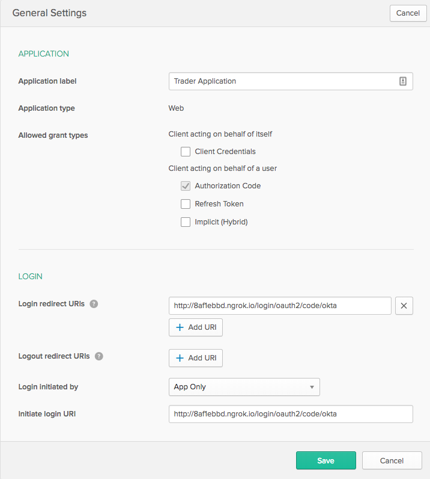

= Spring Security OAuth2 Client

This application is to illustrate how to authenticate to a web-based application using OAuth2.
The code is copied from Joe Grandja's sample application.

The application authenticates using Okta. You can sign up
for an account at https://developer.okta.com/[develoepr.okta.com] and register an application.
Please note the client ID and client secret to update them in application.yml file. Also,
set your Okta's domain in the provider part in the application.yml.

In Okta you need to set a redirect URI, which is the path the application will redirect once
it's authenticated. The URI takes a form of `{baseUrl}/login/oauth2/code/{registrationId}`.
For example, for this application running locally on port 8080, the redirect URI takes a form of
http://localhost:8080/login/oauth2/code/okta (assuming the registration name is okta). I used
ngrok[https://ngrok.com/] to tunnel to localhost over the interet from Okta.

== Steps

. Download and install ngrok if you do not have it already. Open Http tunnel with port 8080.

`ngrok http 8080`

. git clone this repo
. sign up to Okta if you do not already have an account
. register this application and note the client Id and client secret

. makes sure applicaton.yml is updated with the right Okta account URL, client ID and client
secret.
. run the application, and hit http://localhost:8080. You should be redirected to Okta login page
to authenticate.

